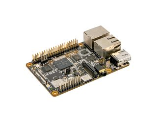

# MaaXBoard-RT-V3--Tensorflow-Lite
TensorFlow Lite model-based implementation of object detector configured to run on MaaXBoard RT Rev 3.

# Table of Contents <!-- omit in toc -->
- [MaaXBoard-RT-V3--Tensorflow-Lite](#maaxboard-rt-v3--tensorflow-lite)
- [Required Hardware](#required-hardware)
  - [MaaXBoard-rt-board](#maaxboard-rt-board)
  - [MCU-Link debug probe](#mcu-link-debug-probe)
  - [MIPI DSI 7-INCH capacitive touch display AES-ACC-MAAX-DISP1](#mipi-dsi-7-inch-capacitive-touch-display-aes-acc-maax-disp1)
  - [MaaXBoard MIPI CSI camera AES-ACC-MAAX-CAM1](#maaxboard-mipi-csi-camera-aes-acc-maax-cam1)
- [Preparing the Demo](#preparing-the-demo)
- [Running the demo](#running-the-demo)
- [Reference](#reference)
# Required Hardware

## MaaXBoard-rt-board 

[](https://www.avnet.com/wps/portal/us/products/avnet-boards/avnet-board-families/maaxboard/maaxboard-rt/)
*<br />[Click image for purchase link]*

- NXP i.MX RT1176 Processor
- Arm Cortex-M7 @1GHz, 32KB/32KB L1 Cache
- Arm Cortex-M4F @400MHz, 16KB/16KB L1 Cache
- Fast Real-time, low-latency response (12ns)
- 2D GPU and Graphics Accelerator
- Advanced Security (on RT1176 plus TO136 Device)
- 2MB of Fast On-Chip SRAM
- (includes 512KB of A7 TCM and 256KB M4 TCM)
- 256 Mb Onboard SDRAM
- 256 Mb Onboard HyperFlash
<p align = "right">
<br />[Click image for purchase link]
</p>


## MCU-Link debug probe

[](https://www.avnet.com/shop/us/products/nxp/mcu-link-3074457345644906182/)
*<br />[Click image for purchase link]*

## MIPI DSI 7-INCH capacitive touch display AES-ACC-MAAX-DISP1

[](https://www.avnet.com/shop/us/products/avnet-engineering-services/aes-acc-maax-disp1-3074457345642357170?krypto=FJFBRsl95iTv7wDNuSR8nKfh4sDa6wB9tRUqa52bF9fY8qx%2F7OjPbCiUNS6NdeU%2FTw2C17S6PEcEqiaAm6FCSHthotP00D7734JXiaXbNjB8KklgQy8Ie4MclHZgTePrekjNQS2KTRs8J2k1oyje7g%3D%3D)
*<br />[Click image for purchase link]*

## MaaXBoard MIPI CSI camera AES-ACC-MAAX-CAM1 
[](https://www.avnet.com/shop/us/products/avnet-engineering-services/aes-acc-maax-cam1-3074457345642357172/)
*<br />[Click image for purchase link]*


# Preparing the Demo
1.  Open the project and build it.

2.  Connect Display and camera
   
3.  Connect a USB cable between the PC host and the OpenSDA USB port on the target board.

4.  Open a serial terminal on PC for OpenSDA serial device with these settings:
    - 115200 baud rate
    - 8 data bits
    - No parity
    - One stop bit
    - No flow control
  
5.  Download the program to the target board.

6.  Either press the reset button on your board or launch the debugger in your IDE to begin running the example.

# Running the demo

To classify an image, place an image in front of camera so that it fits in the
white rectangle in the middle of the display.
The log below shows the output of the demo in the terminal window

```console
Static data processing:
----------------------------------------
     Inference time: 88 ms
     Detected:  stopwatch (87%)
----------------------------------------

Camera data processing:
Data for inference are ready
----------------------------------------
     Inference time: 88 ms
     Detected: No label detected (0%)
----------------------------------------

Data for inference are ready
----------------------------------------
     Inference time: 88 ms
     Detected:     jaguar (92%)
----------------------------------------

Data for inference are ready
----------------------------------------
     Inference time: 88 ms
     Detected:  pineapple (97%)
----------------------------------------
```
# Reference

* [MaaXBoard-rt](https://www.avnet.com/wps/portal/us/products/avnet-boards/avnet-board-families/maaxboard/maaxboard-rt/)
* [Run Practically Any Tensorflow Model on MaaXBoard RT](https://www.hackster.io/monica/run-practically-any-tensorflow-model-on-maaxboard-rt-b2e1c2/)<br> Note: The example code on this site applies to the MaaXBoard RT Rev 2 hardware.
* [eIQ™ Inference with Tensorflow Lite for Microcontrollers oni.MXRT1170 -With Camera](https://community.nxp.com/t5/eIQ-Machine-Learning-Software/Getting-Started-with-TensorFlow-Lite-for-Microcontrollers-on-i/ta-p/1124103?attachment-id=123710)

    